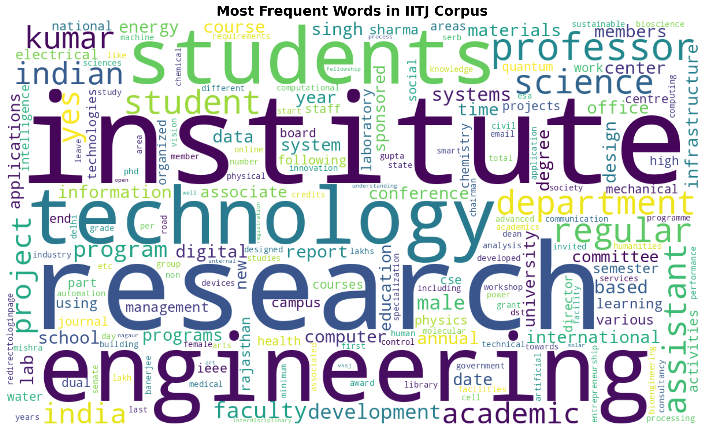
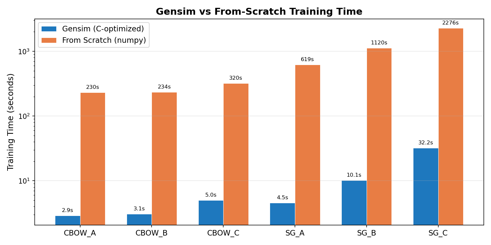
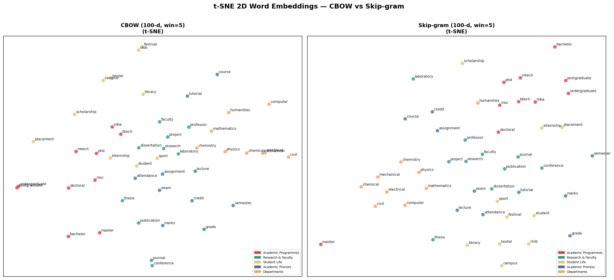

<div align="center">
  
# 🧠 Natural Language Understanding (NLU) - Assignment 2

**Word2Vec from Dynamic Web Crawling & Character-Level Sequence Models for Name Generation.**

[]()
[]()
[]()
[]()

*Course: Natural Language Understanding (NLU), Semester 6*  
*Roll Number: B23CM1054*

---



</div>

## 📑 Table of Contents

- [Overview](#-overview)
- [Problem 1: Word Representations on IITJ Corpus](#-problem-1-word-representations-on-iitj-corpus)
  - [Objective \& Data Collection](#objective--data-collection)
  - [Preprocessing Pipeline](#preprocessing-pipeline)
  - [Word2Vec Implementations (Gensim vs. Scratch)](#word2vec-implementations-gensim-vs-scratch)
  - [Semantic Analysis \& Visualizations](#semantic-analysis--visualizations)
- [Problem 2: Character-Level Name Generation](#-problem-2-character-level-name-generation)
  - [Objective \& Architectures Built](#objective--architectures-built)
  - [Quantitative Evaluation](#quantitative-evaluation)
  - [Qualitative Analysis (Generated Samples)](#qualitative-analysis-generated-samples)
- [Directory Structure](#-directory-structure)
- [Installation \& Usage](#-how-to-run)
- [Reports](#-reports)

---

## 📖 Overview

This repository contains two complete, from-scratch NLP projects:
1. **Word2Vec on Custom Corpus**: A full pipeline that web-scrapes a real-world institutional domain (`iitj.ac.in`), processes text from HTML and complex PDFs, and trains Skip-Gram and CBOW embedding models (both natively in NumPy and using Gensim) to capture rich academic semantics.
2. **Character-Level RNN Generation**: A comparative exploration of sequential architectures (Vanilla RNN vs. Bidirectional LSTM vs. Causal Self-Attention RNN) implemented fundamentally from scratch (without standard PyTorch sequential wrappers) to learn and generate highly realistic Indian names.

---

## 🏗️ Problem 1: Word Representations on IITJ Corpus

### Objective & Data Collection
The goal is to build a custom text corpus by scraping the IIT Jodhpur website and train Word2Vec models on it to evaluate learned word embeddings via nearest-neighbour queries and dimensionality-reduced visualizations.

* **Web Crawler (`scrape_data.py`)**: A Breadth-First Search (BFS) crawler traverses seed URLs across departments, schools, and institutional pages. It harvests HTML text from up to 250 pages.
* **PDF Parsing**: High-value documents like Annual Reports (2008-2024), Academic Regulations, NIRF data, and Placement Brochures (totaling ~50 curated PDFs) are streamed, parsed using `PyMuPDF`, and verified for English language content.

### Preprocessing Pipeline
The raw text (`preprocess.py`) undergoes extensive cleaning:
1. Regex passes to strip URLs, emails, and leftover HTML tags (`<nav>`, `<script>`, etc.).
2. Non-ASCII string filtering to prune incompatible character encodings.
3. Sentence (`nltk.sent_tokenize`) and word (`nltk.word_tokenize`) tokenization.
4. Lowercasing and rigorous stopword removal (including domain noise like "iitj", "http", "click").
5. Length filtering: drops tokens under 3 characters and sentences with fewer than 3 tokens.

**Final Corpus Statistics:**
* **Total Tokens:** `450,793` (~3.6 MB plaintext)
* **Total Sentences:** `26,123`
* **Vocabulary Size:** `27,241` unique words

### Word2Vec Implementations (Gensim vs. Scratch)

We train 6 configurations: 3 **Continuous Bag-of-Words (CBOW)** (predicting middle word from context) and 3 **Skip-Gram with Negative Sampling (SGNS)** (predicting context from middle word) at embedding dimensions of 50, 100, and 200.

1. **Gensim Baseline (`train_word2vec.py`)**: Utilizes highly optimized C-extensions. CBOW relies on hierarchical softmax, while Skip-Gram uses Negative Sampling.
2. **From-Scratch NumPy implementation (`word2vec_scratch.py`)**: Features pure-math implementations of negative sampling with noise distribution scaling ($f(w)^{0.75}$), subsampling of frequent words, linear learning rate decay, and manual Stochastic Gradient Descent.

<div align="center">
  
  <p><i><b>Figure 1:</b> Gensim achieves a 60-130x speedup over the pure NumPy implementation due to multi-threaded C processing, though the scratch implementation accurately learns semantic representations given sufficient epochs.</i></p>
</div>

### Semantic Analysis & Visualizations

We evaluate the structural geometry of the embeddings using Cosine Similarity for nearest neighbors and **3CosAdd** for analogies ($a : b :: c : d \implies d \approx b - a + c$).

**Nearest Neighbours Example (Skip-Gram 200D):**
| Target Word | Gensim Top-3 | Scratch Top-3 |
| :--- | :--- | :--- |
| `research` | activities (0.71), materials (0.66), drdo (0.63) | areas (0.95), groups (0.95), applications (0.94) |
| `phd` | fellowship (0.82), mtech (0.76), doctoral (0.75) | fellowship (0.96), young (0.95), mathematics (0.95) |

**Learned Analogy (From-Scratch Skip-Gram):**
> `undergraduate` : `bachelor` :: `postgraduate` : **`master`** *(Cosine similarity: 0.98)*

<div align="center">
  <br>
  
  <p><i><b>Figure 2:</b> t-SNE plot (Perplexity=10) showing semantic clusters based on word categories. Skip-gram (right) distinctly separates categories (e.g. Academic Processes vs. Student Life) while CBOW (left) averages context heavily, causing broader mixing.</i></p>
</div>

---

## 🧬 Problem 2: Character-Level Name Generation

### Objective & Architectures Built
The goal is to analyze character-level recurrent mechanisms by autoregressively predicting characters to hallucinate structurally sound Indian names based on a training dataset of 1000 names (Avg. length: 14.5 characters, Vocab: 52 tokens).

None of the architectures rely on `nn.RNN`/`nn.LSTM` wrappers; cell logic is explicitly implemented using `nn.Parameter` linear layers.

1. **Vanilla RNN (`model_vanilla_rnn.py`)**: A 2-layer stacked Elman network. Computes updates via $h_t = \tanh(W_{ih}x_t + W_{hh}h_{t-1} + b)$.
2. **Bidirectional LSTM (`model_bilstm.py`)**: A 2-layer encoder mapping sequences forward and backward (concatenating hidden states), fed into a unidirectional decoder. Employs 4 hand-coded gating mechanisms (input, forget, output, candidate) to mitigate exploding/vanishing gradients.
3. **RNN + Causal Self-Attention (`model_rnn_attention.py`)**: Augments the standard RNN pipeline with causal (lower-triangular masked) scaled dot-product attention over historical hidden states, radically improving diversity without needing complex decoder structures.

### Quantitative Evaluation
Models trained on `train.py` (Adam optimizer, lr=0.003, 100 epochs, Gradient Clipping=5.0) are evaluated (`evaluate.py`) algorithmically on 1000 dynamically generated names.

| Architecture | Parameters | Novelty Rate *(Not in training set)* | Diversity *(Unique/Total)* |
| :--- | :--- | :---: | :---: |
| **Vanilla RNN** | 68,471 | 99.50% | 0.9990 |
| **Bidirectional LSTM** | 736,759 | 90.80% | 0.9830 |
| **RNN + Causal Attention** | 92,023 | **98.20%** | **0.9960** |

*Insight: The Causal Self-Attention mechanism vastly improves realism and prevents sequence-length explosion while maintaining high novelty. Bidirectional LSTM suffers slightly in diversity due to exact-sequence mapping bias.*

### Qualitative Analysis (Generated Samples)

| Vanilla RNN | Bidirectional LSTM | RNN + Causal Self-Attention |
| :--- | :--- | :--- |
| Dhanana Gowda | Bhoonondath Sen | **Pankaj Kumar** |
| Isha Agchan | Duldeep Karsan | **Karishma Vanikam** |
| Sokar Bharthen | Ashiq Achande | **Saurabh Jaiswat** |
| Thilakumar Musharla | Chandrasekaran Rajeshnan | **Viswani Pondes** |
| Mohanna Dhunder | Arunachalam Tharsan | **Jeraish Kumar** |

*(Attention generates remarkably fluid structural cross-mapping resembling real regional syntaxes).*

---

## 📂 Directory Structure

```text
Assignment_2/
├── Problem1/
│   ├── scrape_data.py          # BFS web crawler + PDF downloader for iitj.ac.in
│   ├── preprocess.py           # Text cleaning, tokenization, corpus stats
│   ├── train_word2vec.py       # Train 6 Word2Vec configs using Gensim
│   ├── word2vec_scratch.py     # Word2Vec from scratch (CBOW + Skip-Gram)
│   ├── analysis.py             # Nearest neighbours & analogy experiments
│   ├── compare_models.py       # Side-by-side efficiency/accuracy comparison
│   ├── visualize.py            # Generates PCA, t-SNE scatter plots & wordclouds
│   ├── corpus/                 # Contains cleaned_corpus.txt (~3.6MB)
│   └── outputs/                # High-res graphical plots and structural JSONs
│
└── Problem2/
    ├── train.py                # Unified cross-architecture training loop
    ├── evaluate.py             # Generative testing, Sampling Temp scaling, Metrics
    ├── model_vanilla_rnn.py    # Standard Elman cell structure
    ├── model_bilstm.py         # Advanced multi-gated Bidirectional module
    ├── model_rnn_attention.py  # Standard RNN + Scaled Dot-Product Masked Attention
    ├── utils.py                # Name sequences custom dataloader & collate tools
    ├── TrainingNames.txt       # Raw curated training dataset (1000 entries)
    └── checkpoints/            # Epoch-saved .pth weights
```

---

## 🚀 How to Run

### Setup Environment
Ensure Python 3.10+ is installed. Both problems require independent virtual environments.

```bash
# Set up Problem 1 context
cd Problem1
python3 -m venv venv
source venv/bin/activate
pip install -r requirements.txt

# Set up Problem 2 context
cd ../Problem2
python3 -m venv venv
source venv/bin/activate
pip install torch tqdm matplotlib
```

### Running Problem 1 (Word2Vec)
*Run commands from within the `Problem1/` directory.*

```bash
# Step 1: Scrape text corpus from iitj.ac.in limits (Downloads ~50 PDFs & 250 HTMLs)
python scrape_data.py

# Step 2: Clean and tokenize raw dataset into manageable structural tokens
python preprocess.py

# Step 3: Train 6 dimensional/window combinations natively within Gensim
python train_word2vec.py

# Step 4: Execute the from-scratch implementations against the Gensim parameters
python word2vec_scratch.py

# Step 5: Perform Nearest neighbours and 3CosAdd logic tests
python analysis.py

# Step 6: Visual Analytics (saves to outputs/)
python visualize.py
```

### Running Problem 2 (Character-Level Generation)
*Run commands from within the `Problem2/` directory.*

```bash
# Train all three architectures interactively
python train.py --epochs 100 --batch_size 64 --lr 0.003

# Automatically generate 1000 comparative hallucinations and score novelty/diversity
python evaluate.py --samples 1000
```

---

## 📄 Reports
* **`Report.pdf`** documents mapping directly to the underlying architectures, structural choices, and theoretical derivations can be explicitly found within their respective problem directories.
